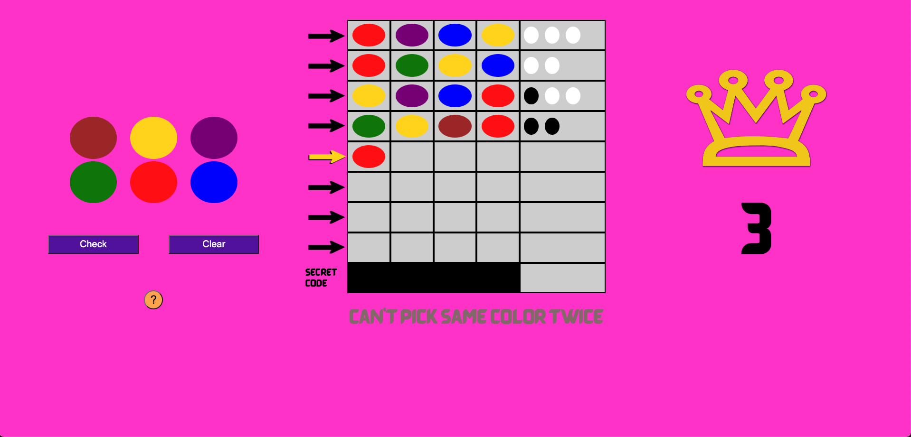

# Mastermind
Mastermind is a famous tabletop game invented in the 70's by Mordechai Meirowitz, a postmaster and telecomunications expert!
It's a two player game where one player, (the code-maker) makes up a code, and the other player (the code-breaker) has to decypher it.
In this version of the game the computer will take the role of the code-maker and the user will take the role of the code-breaker.

## Game screenshot:

## Technologies Used:
 - Javascript, HTML, CSS

## Getting Started
- [Mastermind-Game-Link](https://isbrakha.github.io/1st-project-mastermind/)
- Once you open the game click the question mark button for instructions on how to play

## Next Steps
- Add click animations for color buttons
- Add sound for:
    - Peg placement
    - Check Guess
    - Clear Guess
    - Error sound when trying to place 2 pegs of same color in 1 row
    - Celebration sound for Win Condition
    - Sad sound for lose condition
