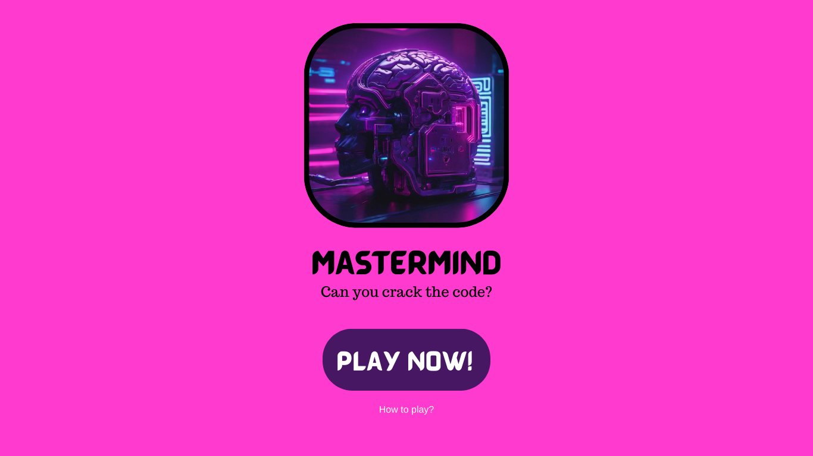
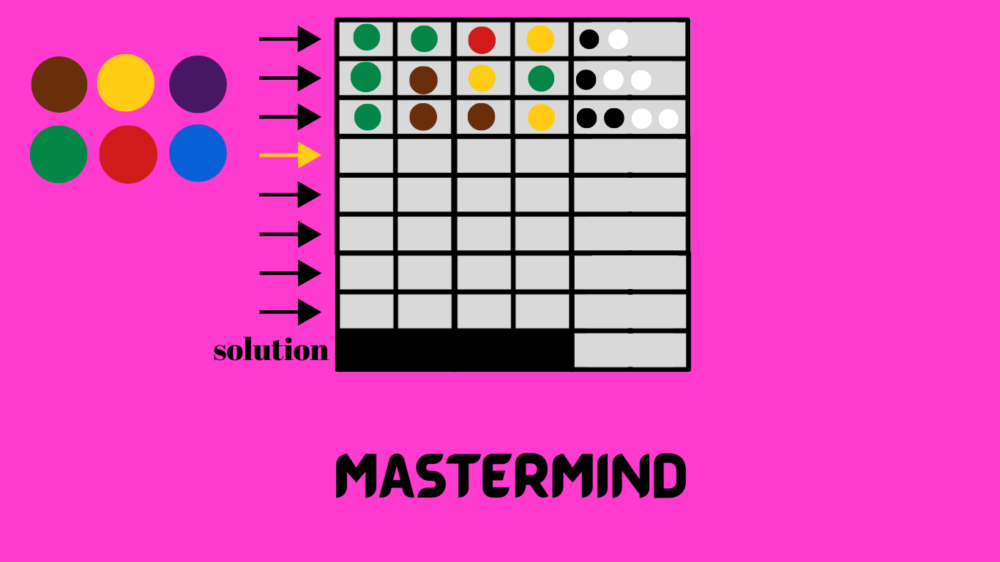

# 1st-Project-Game 
 ## Choice of Game: ***Mastermind!*** 
 ### home-screen:

### main-screen:

## Pseudo-code:
### Create home screen with html:
   
     - Button for play now will be take user to the main game
     - Button for how to play will open a small "window-like" area on top of other elements to display game instruction
## Main game
### Create elements:
    - Choice of pegs button 
    - Game table
    - Arrow pointing the are in table which represnt the guessing turn the playes is currently at, black arrows will point at each row, yellow arrow will point at current row
    - Last row of table will be hidden, at the end of the game it will show the secret code
    - Mastermind in text at bottom 
    - Matermind text will change to You Win! or You lose!, play again button will appear below
    - In the left area of screen at the end of first won game a crown and number will appear representing how many games in a row player has won
    
 ### Initialize game:
    - Generate secret code for player to guess, store it as an array
    - first arrow turns yello
    - Make it so each colored peg the player clicks appears at the appropriate place in the table, then stored in array of key: value objects
    - after each guess, the code shall iterate in in the guess array, and compare the guess array to the secret code array, it will compare the keys and the values of each object, through DOM, a black pegg will appear on the table for each match of key AND VALUE, and a white pegg when only a value matches.
    - the next arrow will turn yellow, and the proccess will repeat until the player guesses the code correctly or he runs out of turns.
    - code for changing the "MINDMASTER" text to YOU WIN! or YOU LOSE!
    - code for rendreing new PLAY AGAIN! button below previously mentinoned text
    - code for rendering the crown and number of consecutive wins!
   
    
    

